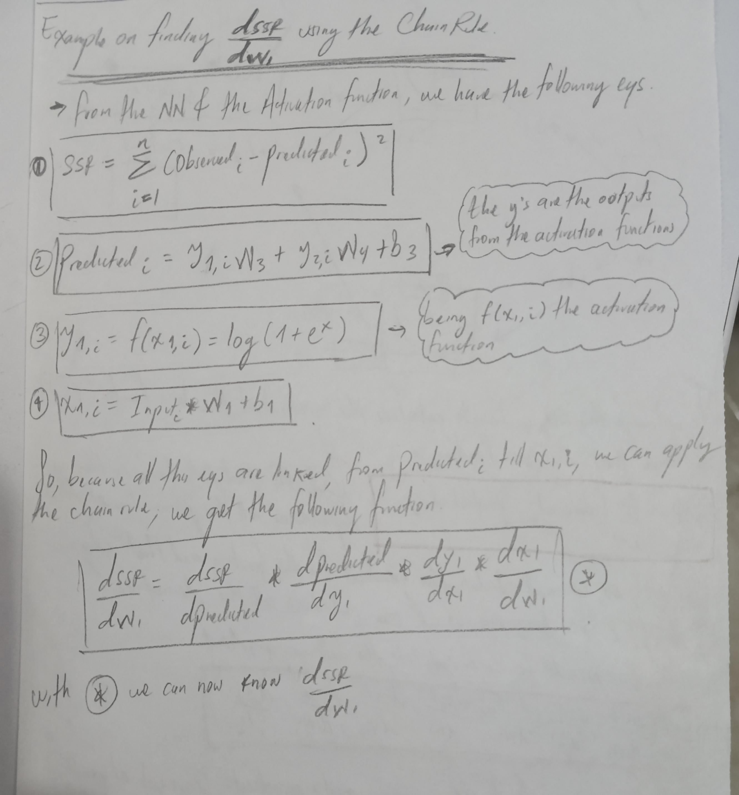

# Notes on studying SQL, Python, etc 🚀🌀🌿 

## Index
<!--<summary>Tabla de contenidos</summary>-->
<ol><!-- Tag for ordered list -->
  <li><!-- list item -->
    <a href="#mathematics">Mathematics</a><!-- a is to create hyperlinks, href specifies the URL-->
    <ul><!-- Tag for unordered list -->
      <li>
        <a href="#two-dimensional-discrete-dynamical-systems">Two dimensional discrete dynamical systems</a>
      </li>
      <li>
        <a href="#differential-equations">Differential equations</a>
        <ul>
          <li>
            <a href="#computational-solutions">Computational solutions</a>
          </li>
        </ul>
      </li>
    </ul>
  </li>
  <li>
    <a href="#programming">Programming</a>
    <ul>
      <li>
        <a href="#python-decorators">Python decorators</a>
      </li>
      <li>
        <a href="#pydantic-for-data-validation">Pydantic for data validation</a>
      </li>
      <li>
        <a href="#web-development">Web development</a>
      </li>
      <li>
        <a href="#ax-method-for-plotting">ax method for plotting</a>
      </li>
    </ul>
  </li>
  <li>
    <a href="#statistics">Statistics</a>
    <ul>
      <li>
        <a href="#causal-inference-and-causation">causal inference and causation</a>
      </li>
    </ul>
  </li>
  <li>
    <a href="#deep-learning">Deep learning</a>
    <ul>
      <li>
        <a href="#chain-rule-and-backpropagation">Chain rule and backpropagation</a>
      </li>
      <li>
        <a href="#rag-retrieval-augmented-generation">RAG Retrieval Augmented Generation</a>
      </li>
      <li>
        <a href="#generative-ai-with-LangChain">Generative ai with LangChain</a>
      </li>
    </ul>
  </li>
  <li>
    <a href="#cloud-computing">Cloud computing</a>
  </li>
  <li>
    <a href="#gunicorn">Gunicorn</a>
  </li>
</ol>


## Mathematics


## Programming
### Python decorators
A decorator is a function that modifies the behavior of another function or method. Can be created using @ and they are used for code reuse and to add general functionalities to methods/functions.

The following code shows how to create a simple decorator which only calculates how much time takes to excecute a function. 

```python
import time

# Creating decorator
# The decorator recieves a function as parameter
def timer_decorator(func): 
    # wrapper envuelve la función original, y toma cualquier numero de 
    # argumentos y parámetros para poder recibir cualquier función y 
    # ejecutarla adentro suyo.
    def wrapper(*args, **kwargs):
        start_time = time.time()
        result = func(*args, **kwargs)
        end_time = time.time()
        elapsed_time = end_time - start_time
        print(f"Function {func.__name__} took {elapsed_time:.4f} seconds to complete")
        # wrapper returns the result of the original function.
        return result
    # timer_decorator returns the wrapper function
    return wrapper

# decorating the function
@timer_decorator
def example_function(n):
    total = 0
    for i in range(n):
        total += i
    return total

# Calling decorated function
result = example_function(1000000)
print(f"Result: {result}")
```
#### Explaining code of decorators
timer_decorator returns the wrapper function (**returns the reference to wrapper**), but do not calls it. This means that we can create a variable to assign to the timer_decorator and consequently use that variable as it was the wrapper function. 

For example, in the following code, we assing timer_decorator to a variable called "var" and then we can use "var" as it was the function wrapper. 

```python
var = timer_decorator(example_function)
print(var(4))
```

When we apply a decorator to a function using the @, it is equivalent to do the following: 
```python
example_function = timer_decorator(example_function) 
```
Here we assign to the variable "example_function", the new functionalities of the decorator, so this means that after the function is decorated, when we use the example_function function, **WE ARE CALLING THE *wrapper* function** instead of the original one. 


### Pydantic for data validation

### Web development

 🎲 For a more detailed doccumentation on web development, go to my GitHub repo where I construct a complete web page which is a complete videogame: [**HERE**](https://github.com/HijoBejuco/video-game-development)

### ax method for plotting

Here a basic example for plotting multiple sub-plots using ax method

```python
import pandas as pd
import matplotlib.pyplot as plt

# Datos de ejemplo
data = {
    'segmentos': ['A', 'B', 'A', 'B', 'A', 'B'],
    'ingresos_2024': [100, 200, 150, 250, 120, 220],
    'ingresos_2025': [110, 210, 160, 260, 130, 230]
}

# Crear DataFrame
df = pd.DataFrame(data)

# Crear una figura y ejes con coordenadas ax[0,0] y ax[1,0]
# Here we create the structure of the basic plot. whether
# we want to create a matrix of plots, or just one column,
# or just one row or an n x n plot. In this case, we just
# need 2 rows and 1 column (2, 1) matrix.
fig, ax = plt.subplots(2, 1, figsize=(10, 8))

# Plotear boxplot para ingresos_2024 en ax[0,0]
# Here we assign the data we are plotting on each sub-plot
df.boxplot(column='ingresos_2024', by='segmentos', ax=ax[0])
ax[0].set_title('Distribución de ingresos por segmentos en 2024')
ax[0].set_xlabel('Segmentos')
ax[0].set_ylabel('Ingresos')
# Rotate x-axis tick labels for the first subplot
ax[0].set_xticklabels(ax[0].get_xticklabels(), rotation=90)
# plot limits
ax[0].set_ylim(0, 0.2e8)

# Plotear boxplot para ingresos_2025 en ax[1,0]
# Here we assign the data we are plotting on each sub-plot
df.boxplot(column='ingresos_2025', by='segmentos', ax=ax[1])
ax[1].set_title('Distribución de ingresos por segmentos en 2025')
ax[1].set_xlabel('Segmentos')
ax[1].set_ylabel('Ingresos')
# Rotate x-axis tick labels for the first subplot
ax[1].set_xticklabels(ax[1].get_xticklabels(), rotation=90)
# plot limits
ax[1].set_ylim(0, 0.2e8)

# Ajustar el layout
plt.tight_layout()

# Mostrar gráficos
plt.show()
```

## Arrays in bigquery and sql

### ARRAY_AGG:
This is an Aggregating function, so it aggregates all the values using a group by clause. It takes different rows and transform them into a single row of ARRAY datatype. 


## Statistics

### **causal inference and causation**


* Machine learning is based on *predictive inference*, which is very different from causal inference. The first one is based on correlation and the other on causation.
* But ML can be used in some cases as a tool for studying causalities (Causal ML)

#### **Predictive inference:**
Prediction based on correlations like ML: here we predict something, based on the values of other variables. Here the objective is to predict the objective variable the best we can. 

#### **Causal inference**
aims to measure the value of the outcome when you change the value of something else, everything else equal. 

Here the quality of the prediction is not the most important objective, it's possible to have a valid causal model, with low predictive power, because it can just explain a little variance of the phenomena. 

**Counterfactual:** is the world where we don't make the intervention, so we can compare both worlds (the one with intervention and the one without)
* The comparison with the 2 worlds is the **Causal effect**

**Counterfactual example:**

Imagine you have a headache, then you take a pill, and later, the headache is gone. But was it because the pill? or something else like a tea or a bottle of water? Its impossible to know which factor helped as all those effects are confounded. The only way to answer this perfectly, would be to have two parallel worlds, where in one world you take the pill and in the other dont. *As the pill is the only difference between the two situations*, it would allow you to claim that it was the cause. But obviously, we do not have parallel worlds to play with. In causal inference, we call this: ***The fundamental problem of causal inference***.


So because pure counterfactual is impossible, causal inference uses *randomized experiments* to approximate a counterfactual. If you randomize the treatment allocation (pill vs. placebo), the only systematic difference is the treatment, and hence a statistically significant difference in outcome can be attributed to the treatment.

* Note, we can measure causal effects with observational data, instead of randomized experiments. For more info, go [here](https://towardsdatascience.com/the-science-and-art-of-causality-part-1-5d6fb55b7a7c)

#### **Why correlation does not imply causation?**
From the following image, we can say that the correlation between drowning and ice cream sales is due a common cause: weather. There is not causal link between drowning and ice cream sales. This is what we call a *spurious correlation*.

Also, there is an effect of education on performance, but cognitiva capacity affects both. So, here, the positive correlation between education and job performance is confounded with the effect of cognitive capacity.


**Mediators:** In ML, features are selected based on their predictive power. However, in causal inference, certain features (confounders/common causes) must be included regardless of their predictive power or statistical significance, because the objective here is to assess how those features affect the predicting variable. Conversely, mediators, which represent indirect causal pathways, should not be included as they prevent measuring the total causal effect. Thus, *the inclusion of features in causal inference depends on the assumed causal relationships between variables*.


#### **Why is it problematic to use ML for inferring causal effects?**

Imagine interpreting the positive association between ice cream sales and drowning accidents as causal. You might want to ban ice cream at all costs. But of course, that would have potentially little to no effect on the outcome.


Another example: During pandemic, a French "expert" used a graph to argue that lockdowns were counterproductive, showing a positive correlation between lockdown stringency and Covid-related deaths. However, this was likely due to reverse causation: countries imposed strict measures when deaths were high. Proper analysis, controlling for confounders, showed that lockdowns had a strong negative effect on the number of cases and deaths.

#### **How can causal and predictive inference be used together?**
Companies use ML to solve the prediction problem of recommending products to clients. However, to understand the effect of the recommendation system on sales or conversions, causal inference is needed. This involves conducting  randomized experiments (A/B testing) to determine the impact accurately. 
* tests evaluating both scenarios, when ML is used and when dont, and with this information, performing statistical tests to see whether ML improve conversion. 

#### **Natural experiments:**
Natural experiments are used when we dont want to conduct a randomized control trial in a lab. 

**Example:** 

If we want to asses the effect of pollution on health, we couldnt compare between people from cities to rural areas, because there could be drastic differences between those two populations, because they **eat, move, work, etc... very differently.**, it is also not possible to conduct this in a laboratory, because its not possible to poisson a group of humans to test whether their health is affected by pollution. 

To solve this problem, we can resort to a **natural experiment:** In the Beijing olimpic games, they decided to lower pollution, shutting down power plants and limiting car use, allowed researchers to observe the same population before, during, and after a sudden drop in pollution levels.

#### **How to challenge causality? main drawbacks:**

**References of this section:** Basically all the amazing visualizations and theories of this section are taken from: 
* [Why Machine Learning Is Not Made for Causal Estimation](https://towardsdatascience.com/why-machine-learning-is-not-made-for-causal-estimation-f2add4a36e85)
* [The Science and Art of Causality (part 1)](https://medium.com/data-science/the-science-and-art-of-causality-part-1-5d6fb55b7a7c)


## Deep learning

### The linear unit
This is the fundamental component of a NN. The individual neuron. A neuron with one input looks like: 

The input is x,the connection to the network has a weighy w, whenever the input flows through a connection, the value is multiplied by the weight. A NN "learns" by modifying its weights.

**b** is a special weight called the bias, this has not any input., thats why, The bias enables the neuron to modify the output independently of it's inputs. 

**y** is the output of the neuron. The neuron sums up all the values it recieves through its connections. The neuron's activation is: ***y=wx+b*** (This is just the equation of a line)

### Chain rule and backpropagation

Here are some notes on how to perform Backpropagation when a Neural network is being optimized




### Generative ai with LangChain
First of all, we need to configure how we will make calls to a LLM, this is basically to configure an API key of a LLM. To see this, into this repository: *deep_learning/generative_ai_with_longchain_gen_ai_notebook.ipynb*

#### Prompt templates
this templates are used for parametrize inputs, so we don´t repeat them. We use the class **ChatPrompTemplate** to do so. 

Here we set the instruction that the llm is a comedian, and then as a human, we ask it to tell a joke. 

```python
from langchain_core.prompts import ChatPromptTemplate

joke_prompt = ChatPromptTemplate.from_messages([
    ("system", "You are a world class comedian."),
    ("human", "Tell me a joke about {topic}")
])
```

Then, we can format the prompt, using the .invoke method, so it tells us a joke about beets. 
```python
joke_prompt.invoke({"topic": "beets"})
```

#### Chaining
The prompt template and the chat model implement the .invoke() method, so they are both LangChain *Runnable* objects

We can joint runnables into **chains**, using the pipe operator, where we .invoke() the next runnable with the output of the previous one. 

```python
chain = joke_prompt | chat_model
```
The resulting chain is itself a runnable, so it has the .invoke() method. 

```python
chain.invoke({"topic": "beets"})
```
If we want yo work with the raw output of the llm, so we have to use the output parser. 

```python
from langchain_core.output_parsers import StrOutputParser
str_chain = chain | StrOutputParser()
str_chain.invoke({"topic": "beets"})

# Equivalent to:
# str_chain = joke_prompt | chat_model | StrOutputParser()
```
#### Generation with context
Its very usefull to pass data into the llm, so it learns on private data we've injected, and then we make questions. 

See the following example:
```python
SOURCE = """
Old Ship Saloon 2023 quarterly revenue numbers:
Q1: $174782.38
Q2: $467372.38
Q3: $474773.38
Q4: $389289.23
"""

rag_prompt = ChatPromptTemplate.from_messages([
    ("system", 'You are a helpful assistant. Use the following context when responding:\n\n{context}.'),
    ("human", "{question}")
])

rag_chain = rag_prompt | chat_model | StrOutputParser()

rag_chain.invoke({
    "question": "What was the Old Ship Saloon's total revenue in Q1 2023?",
    "context": SOURCE
})
```

**References of this section:**
* [Here](https://www.freecodecamp.org/news/beginners-guide-to-langchain/)
* 


### RAG Retrieval Augmented Generation
* The motivations for RAG is to feed an LLM with private data, so it has a better understanding of a specific topic.
* Notebook for creating a RAG using LangChain is here: *deep_learning/generative_ai_with_langchain/rag_generation_langchain.ipynb*


## Cloud computing


## Gunicorn
Gunicorn is a program that handles receiving requests from users on the internet (like when you open a web page) and passes those requests to an application written in Python (for example, a website that was programmed in Python).

Then, the Python application generates a response (such as displaying a web page) and Gunicorn takes care of sending it back to the user.

Why do you need Gunicorn? When you program something in Python, it normally runs from the terminal (console), and only you can use it. If you want others to be able to use your program (for example, through a web browser or an API), you need a server that listens to user requests and communicates with your application. This is where Gunicorn comes into play.

Gunicorn is the bridge that allows anyone to access your Python application through a browser or a mobile app, instead of only from your computer.

Real-life example: Imagine you have a small store. You are the one in charge of receiving customers and attending to their orders, but you can only help one person at a time. If more people arrive, you can’t assist them all at once.

Now, Gunicorn would be like hiring a team of employees (called "workers") who help you attend to several people at the same time, which makes your store run better and faster, even if a lot of people show up.

Your Python program is the store. Gunicorn is the team of employees that helps the store run smoothly and serve many customers at the same time. The customers are the users who want to access your website or application.

What happens without Gunicorn? If you don’t use something like Gunicorn and simply run your Python program in basic mode, only one person at a time would be able to use your application. This is fine if only you are using it, but it won’t work for most web applications that need to serve many people at once.

Summary: Gunicorn is like a "server" that makes your Python application available for others to use, just like a website. It helps your application run efficiently, even when many people are trying to access it at the same time. If in the future you’re developing an application or service in Python and want it to be available to many people, Gunicorn allows you to do this in a simple and efficient way.


